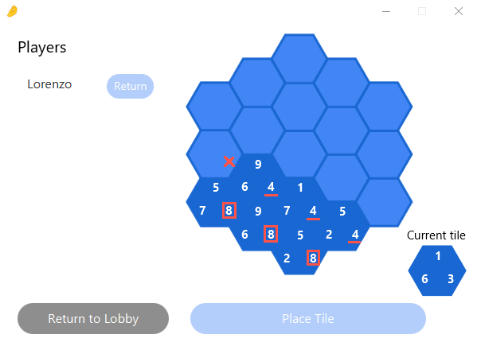
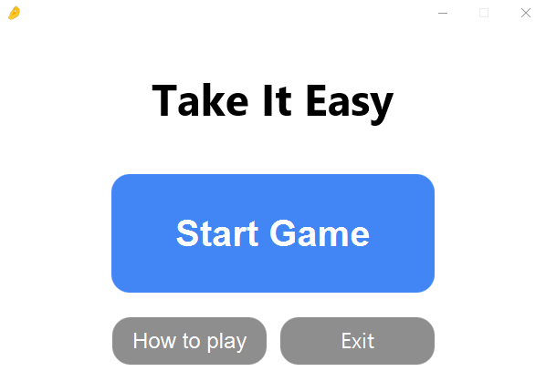
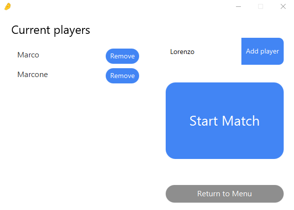
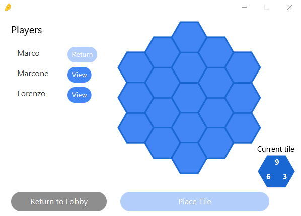
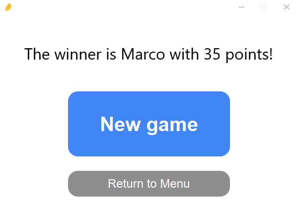
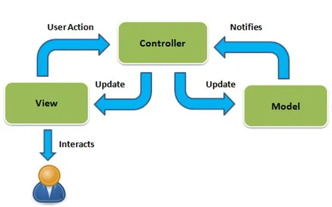

# Take it Easy

## What is this?
This is an implementation of the the board game "Take it Easy" by Peter Burley in the Java programming language, created as part of the Software Development Methods course at the University of Trieste, Italy.
The project is intended for educational purposes only and no copyright infringement is intended.
The authors of the project are Lorenzo Cavuoti, Marco Sicklinger and Marco Sciorilli.

## Game rules:

1. On each turn, select one of the 19 empty hexagonal slots to place a tile by clicking on the slot and confirming with the "Place Tile" button.
2. Once a tile is placed, its location cannot be changed and the next player will place the same tile.
3. This process continues until all players have placed the tile, then a new tile is drawn from a set of 27 possible tiles.
4. This cycle repeats until all slots on the hexagonal board are filled. Once all slots are filled, the game ends and the player with the highest number of points is declared the winner.

### Calculating points:

1. Points are earned by aligning tiles with the same value on the line that corresponds to their orientation.
2. When all tiles in a line have the same number, the line is worth that number multiplied by the number of tiles on the line.

As an example, in the figure below, the 8-line is worth 24 points while the 4-line above it is worth 0 points, as it is not completed.

## In-game controls

To make the game as user-friendly as possible, we've kept the user interface simple and intuitive. Here's a quick overview of the controls.

### Starting a Game

When you launch the application, you can start a new game by clicking the "Start Game" button in the game menu. This will take you to the lobby, where you can add or remove players.

### Adding Players

You can add new players by typing their name into the form in the top right corner. As soon as you start typing, the "Add Player" button will light up, indicating that you can add that player. Note that you cannot add two players with the same name; if you try, the "Add Player" button will be disabled. Once you've added at least one player, the "Start Match" button will light up, indicating that you can begin the game.

### Removing Players

You can remove players by clicking the "Remove" button next to their name. The "Remove" button will only appear once you've added a player to the player list.

Once you've added all the players you want, you can start the match with the "Start Match" button.

### Placing Tiles

During your turn, you can place a tile in any available slot (indicated by a light blue color) by clicking on it with your mouse. Confirm the placement by clicking the "Place Tile" button. You can also view the boards of other players by clicking the "View" button on the left side of the screen. To return to your own board, click the "Return" button on the right side.
Win Screen

### Victory screen

Once all players have filled their boards with tiles, the victory screen will be displayed. Here, you can see the winner, start a new game, or return to the main menu.

## Development Overview

After conducting an initial exploration phase as a team, we chose to implement the *Model-View-Controller* (MVC) design pattern for our application. We then divided the work evenly among the group members:

* Lorenzo Cavuoti was responsible for UI development using JavaFX and SceneBuilder.
* Marco Sicklinger focused on the controller.
* Marco Sciorilli worked on the model.

To ensure effective collaboration and progress tracking, we held weekly meetings throughout the project. We also implemented a test-driven approach for the model and controller, while the UI was tested manually.

The project was written in Java 17 and built using gradle version 7.4. We also utilized Travis CI for build automation in the final phase of the project, as the free version only lasts one month. Development was primarily done using IntelliJ IDEA on both Linux and Windows machines, and version control was managed through Github.

### Dependencies
* Java 17.0.5
* Gradle 7.4
* gson 2.10
* junit 5.9.0
* javafx 17.0.2

## Architecture
We organized the code in different packages, each performing a separate task:
* The engine under main.java.engine implements the game logic and structure. The *engine* package is located in` main.java.engine` and it is divided into three components: the **model**, the **state** and the **controller** packages.
* The user interface under main.java.ui which implements the UI using the JavaFX library.
* An utils package main.utils, containing utility functions for the classes.
* An exceptions package main.exceptions, containing custom exceptions that can be thrown during program execution.

The application entrypoint is defined in the takeiteasy.Main class, which simply launches the takeiteasy.GUI.FXApplication.

### Engine: model

#####  Board

* `BoardInterface`:  public interface for the generic game board to fulfill the Open-Closed SOLID principle. This interface allows for the use of different boards that are required to play various versions of the classic Take It Easy game rules.
* `BoardClassic`:  class  responsible for implementing the game board used to play the traditional version of Take It Easy. It contains methods for placing tiles, retrieving the board, get the coordinates of the cell's centers as well as for computing the player's score.

##### Tile

* `TileInterface`:  public interface for the generic Tile to fulfill the Open-Closed SOLID principle. This interface allows for the use of different Tile's shapes that are required to play various versions of the classic Take It Easy game rules.
* `Tile`: class  responsible for implementing the  tile used to play the traditional version of Take It Easy. It contains methods for retrieving the tile values, as well as an equals method to identify identical tiles.

#####  Utils

* `CubeCoordinates`: class implementation of the Java Comparable interface. This class represent a set of three coordinates in an hexagonal grid necessary for the classical version of the Take It Easy board. It contains methods to retrieve coordinates, override comparisons methods between coordinates, navigate through the grid and map to Euclidean coordinates.
* `HexagonalGrid`: Utility class to generate a set of centers of hexagonal cells in normalized Euclidean coordinates to be used by the UI to draw the board.

### Engine: state

#### State
The *state* (`main.java.engine.state`) package contains the following java files:
* `main.java.engine.state.MatchStateInterface.java`: public interface for the state of the game, providing all the methods needed to store and retrieve the information about the model which can be useful at the higher level of the implementation (Controller and UI);
* `main.java.engine.state.MatchState.java`, containing the java class **MatchState** which implements the aforementioned java interface. All the public methods implemented in this class are used only in the controller implementation in order to comply with the MVC pattern logic. This class has for `private` attributes
  * `ArrayList<BoardInterface> boards` stores the `BoardInterface` implementations of the players in the game;
  * `ArrayList<TileInterface> tileCache` stores the `TileInterface` implementations for the tiles still available (drawable);
  * `TileInterface currentTile` stores the `TileInterface` implementation of the just drawn tile (the tile to be placed in the current round of the game);
  * `Integer currentPlayerIndex` stores the index of the player who needs tom place the tile in the current turn;
  
  The `public` implemented methods are:
  * `int getCurrentPlayerIndex()` returns the index of the board in which a player is currently placing a tile (current player's board);
  * `void setNextPlayer()` updates (increments by one) the index "pointing" of the current board;
  * `void drawTile()` randomly extracts a tile from the `tileCache`;
  * `void addBoard(BoardInterface)` adds a board given an implementation of the `BoardInterface`;
  * `void deleteBoard(int)` removes a board from `boards` given the corresponding index of the player to be eliminated;
  * `void fillBoardCell(int)` invokes the `BoardInterface::placeTile` method in order to place a tile in the given candidate position index;
  * `List<BoardInterface> getBoards()` returns the copy of all the boards in the game;
  * `int getNumberOfBoards()` returns the number of boards in the game (tht is the number of players);
  * `TileInterface getCurrentTile()` returns the just drawn tile (that is the tile to be placed by the players);
  * `int getBoardIndex(String)` returns the corresponding index in `boards` of a player given its nickname;
  
  One additional `private` method was added:
  * `void initializeTileCollection()` initializes the collection of tiles in the `tileCache`. Since it depends on the specific implementation of the game (`TileLoader` and consequently `TileGenerator`, or an existing file for storing the tiles), the `private` access modifier has been chosen.

### Engine: controller

#### Controller
The *controller* (`main.java.engine.controller`) package contains the following files:
* `main.java.engine.controller.GameControllerInterface.java`: public interface acting as a bridge between the *Model* and the *View* ends of the MVC pattern. It provides all the method which are accessible from the UI. 
* `main.java.engine.controller.GameController`: it contains the java class **GameController** which implements the _GameControllerInterface_. The public methods in the implementation of _GameControllerInterface_ are all used only in the classes the UI consists of, in order to follow the MVC pattern as much as possible. 
  The implemented `public` methods are the followings:
  * dd
--to be continued--

### UI
The UI package is located in main.java.ui and is divided into various controller classes, each corresponding to a different window or screen that the user interacts with. The navigator class manages the movement between these windows.
During the implementation of the UI, we ensured user-friendliness by disabling buttons that would lead to illegal actions such as adding a player that already exists or starting a match when no players are present. This approach not only enhances the user experience but also reduces the need for error handling in the code.

The whole ui uses a unique css style sheet which allows to change the visual appearance with minimal effort, found in `main.resources.ui.css`.

The UI is made up of four different views, each controlled by its own controller and implemented in JavaFX FXML files:

* Main Menu: This is the first view that the user sees when they launch the program. It is located in the `ui.windows.mainmenu` package and has buttons for starting a game, accessing the game's rules, and exiting the program.
* Lobby: This view can be accessed from the Main Menu and is located in the `ui.windows.gamelobby` package. Here, the user can add or remove players and start the game. The view communicates changes to the controller, which updates the model accordingly.
* Main Game: This view, located in the `ui.windows.gameboard package`, is where the players play the game against each other. It has an additional UI logic layer that keeps track of the `viewedPlayer`, which is the player whose board is currently being displayed, , and the `candidateTilePlacement` which keeps track of the last clicked tile on the board, which corresponds to the tile placement of the current player.
* Game Over: This view displays the winner(s) of the game and has options to return to the Main Menu or start a new game. It is located in the `ui.windows.game_over` package.

Finally, each controller implements the `UIControllerInterface` interface, defined in `main\java\ui\windows\UIControllerInterface.java`. The interface defines a single method, `initController(GameInterface gameController)`, which is essential for all UI controllers to connect to the gameController defined in the engine package. Connecting to the gameController is crucial as it enables navigation between different views of the game by maintaining the current state of the game. For example, when transitioning from the lobby view to the Main Game view, it is important to keep track of the player names, which can only be achieved by passing the gameController between the different UIControllers.

## References
* Take it easy rules: https://en.wikipedia.org/wiki/Take_It_Easy_(game)
* MVC Diagram image: https://thedotnetguide.com/mvc-design-pattern/
